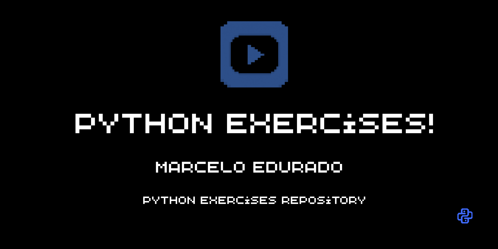

   

# curso-em-video-python
Repositório criado para armazenar exercícios e projetos desenvolvidos durante meus estudos em Python, com o intuito de ver a minha evolução.

## Conteúdo

- Exercícios inspirados no canal Curso em Vídeo, do professor Gustavo Guanabara.
- Projetos práticos.
- Estudos de programação e lógica.

- ## Tecnologias

- Python 3

- ## Autor

- Marcelo Eduardo dos Santos
